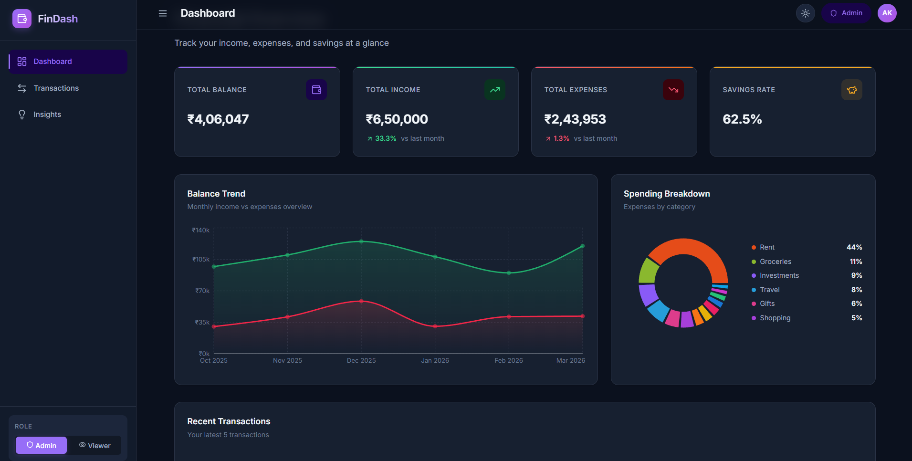
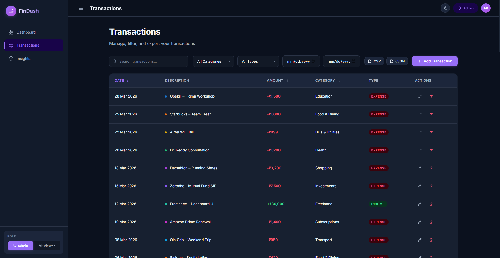
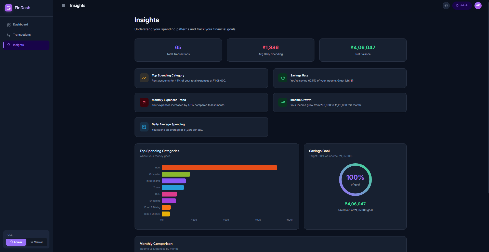
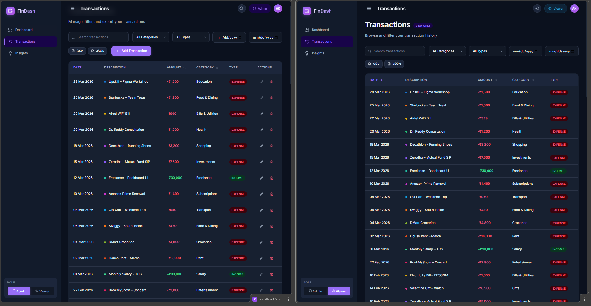

# FinDash — Finance Dashboard UI

A premium, visually stunning finance dashboard built with **React + Vite** to track and understand your financial activity. Features interactive charts, transaction management with CRUD operations, spending insights, and role-based access control — all with a beautiful dark glassmorphic design.


---

## 🚀 Quick Start

```bash
# 1. Install dependencies
npm install

# 2. Start development server
npm run dev

# 3. Open in browser
# → http://localhost:5173
```

---

## 📋 Project Overview

**FinDash** is a frontend-only finance dashboard that simulates a complete personal finance tracking experience. It uses 65+ realistic mock transactions in **INR (₹)** spanning 6 months (Oct 2025 – Mar 2026), featuring real Indian brands and services (Swiggy, Zomato, Zerodha SIPs, BigBasket, etc.).

The dashboard is designed to demonstrate:

- Clean component architecture
- Effective state management
- Data visualization best practices
- Role-based UI behavior
- Responsive, accessible design

---

## 🛠 Tech Stack

| Technology       | Version | Purpose                                        |
| ---------------- | ------- | ---------------------------------------------- |
| **React**        | 18.3    | UI component framework                         |
| **Vite**         | 5.4     | Build tool with fast HMR                       |
| **Zustand**      | 4.5     | Lightweight global state management            |
| **Recharts**     | 2.12    | React-native chart library                     |
| **React Router** | 6.26    | Client-side routing                            |
| **Lucide React** | 0.441   | Beautiful SVG icon library                     |
| **date-fns**     | 3.6     | Date formatting utilities                      |
| **Vanilla CSS**  | —       | Custom properties + glassmorphic design system |

### Why This Stack?

- **Vite** over CRA: 10x faster dev server startup, instant HMR, optimized builds
- **Zustand** over Redux/Context: Minimal boilerplate, built-in `persist` middleware for localStorage, no providers needed
- **Recharts** over Chart.js: React-native components (not canvas), composable, responsive out of the box
- **Vanilla CSS** over Tailwind: Full control via CSS custom properties, glassmorphic effects, complex animations without utility class bloat
- **Lucide** over Heroicons: Consistent 24x24 design, tree-shakeable, wider icon set

---

## ✨ Features

### 📊 Dashboard (Home)

- **4 Summary Cards** — Total Balance, Income, Expenses, Savings Rate with month-over-month trend indicators
- **Balance Trend Chart** — Area chart showing 6-month income vs expenses
- **Spending Breakdown** — Donut chart with category-wise expense distribution
- **Recent Transactions** — Quick view of latest 5 transactions

### 💳 Transactions

- **Full Data Table** — Date, description, amount, category, type with category color dots
- **Search** — Real-time text search across description and category
- **Multi-Filter** — Category dropdown, type toggle, date range picker
- **Sortable Columns** — Click headers to sort by date, amount, or category (asc/desc)
- **Add Transaction** (Admin) — Modal form with validation
- **Edit Transaction** (Admin) — Pre-filled modal for existing transactions
- **Delete Transaction** (Admin) — Confirmation dialog before deletion
- **Export** — Download filtered data as CSV or JSON
- **Empty State** — Graceful UI when no results match filters

### 🔍 Insights

- **Quick Stats Row** — Transaction count, average daily spending, net balance
- **Smart Insight Cards** — Auto-generated observations (top category, savings rate, spending trends, income growth)
- **Top Spending Categories** — Horizontal bar chart ranking expense categories
- **Savings Goal** — Animated SVG progress ring tracking savings vs 30% target
- **Monthly Comparison** — Grouped bar chart (income vs expenses by month)

### 👥 Role-Based UI

- **Admin Role** — Full access: add, edit, delete transactions
- **Viewer Role** — Read-only: action buttons hidden, "View Only" badge shown
- **Role Switcher** — Toggle in sidebar, persisted in localStorage
- **Visual Indicators** — Role badge in header changes color/icon by role

---

## 🔄 State Management Approach

The app uses **Zustand** with the `persist` middleware:

```
Store
├── Data
│   └── transactions[]          ← 65 mock transactions
├── UI State
│   ├── role                    ← 'admin' | 'viewer'
│   ├── searchQuery             ← text search string
│   ├── filters                 ← { category, type, dateFrom, dateTo }
│   ├── sortConfig              ← { key, direction }
│   └── sidebarOpen             ← boolean
├── Actions
│   ├── addTransaction()
│   ├── editTransaction()
│   ├── deleteTransaction()
│   ├── setRole() / setFilters() / setSortConfig()
│   └── resetFilters()
└── Selectors
    └── getFilteredTransactions()  ← derived, filtered + sorted data
```

**Persistence**: `transactions` and `role` are saved to `localStorage` via Zustand's persist middleware, so data survives page reloads.

**Performance**: Components use atomic selectors (e.g., `useStore(s => s.role)`) to prevent unnecessary re-renders.

---

## 🎨 Design System

- **Theme**: Dark glassmorphic with `backdrop-filter: blur(12px)` cards
- **Colors**: CSS custom properties (`--accent-primary`, `--color-income`, `--color-expense`, etc.)
- **Typography**: Inter (Google Fonts) with a 7-step type scale
- **Animations**: `fadeInUp`, `scaleIn`, staggered delays, hover lifts, progress ring transitions
- **Responsive**: Fluid grid layouts, sidebar collapse, mobile-first media queries

---

## 📁 Project Structure

```
src/
├── components/
│   ├── layout/         → Sidebar, Header, Layout
│   ├── dashboard/      → SummaryCards, BalanceTrend, SpendingBreakdown, RecentTransactions
│   ├── transactions/   → TransactionList, TransactionForm
│   └── insights/       → TopCategories, MonthlyComparison, InsightCards, SavingsGoal
├── pages/              → DashboardPage, TransactionsPage, InsightsPage
├── store/              → Zustand store (useStore.js)
├── data/               → Mock transactions (mockData.js)
├── utils/              → Formatters, calculation helpers
├── App.jsx             → Router setup
├── App.css             → Component styles
├── index.css           → Design system (tokens, reset, utilities)
└── main.jsx            → Entry point
```

---

## 📸 Screenshots

### Dashboard

> 

### Transactions

> 

### Insights

> 

### Role Switching

> 

_Admin vs Viewer UI comparison — action buttons appear/hide_

---

## 🔮 Future Improvements

- [ ] **Light mode toggle** — Full light theme with smooth transition
- [ ] **Recurring transactions** — Mark transactions as monthly recurring
- [ ] **Budget limits** — Set per-category spending limits with alerts
- [ ] **Date range presets** — "This month", "Last 3 months", "Year to date"
- [ ] **Drag-and-drop dashboard** — Customize widget arrangement
- [ ] **Charts zoom/pan** — Brush component for time-series drill-down
- [ ] **PWA support** — Offline-capable with service worker
- [ ] **Multi-currency** — Support USD, EUR with conversion rates
- [ ] **Data import** — Upload CSV/bank statements to add transactions
- [ ] **Backend integration** — REST API with auth (JWT) and database

---

## 📜 License

This project is built for educational/evaluation purposes.

---

<p align="center">
  Built with ❤️ using React + Vite + Zustand
</p>
